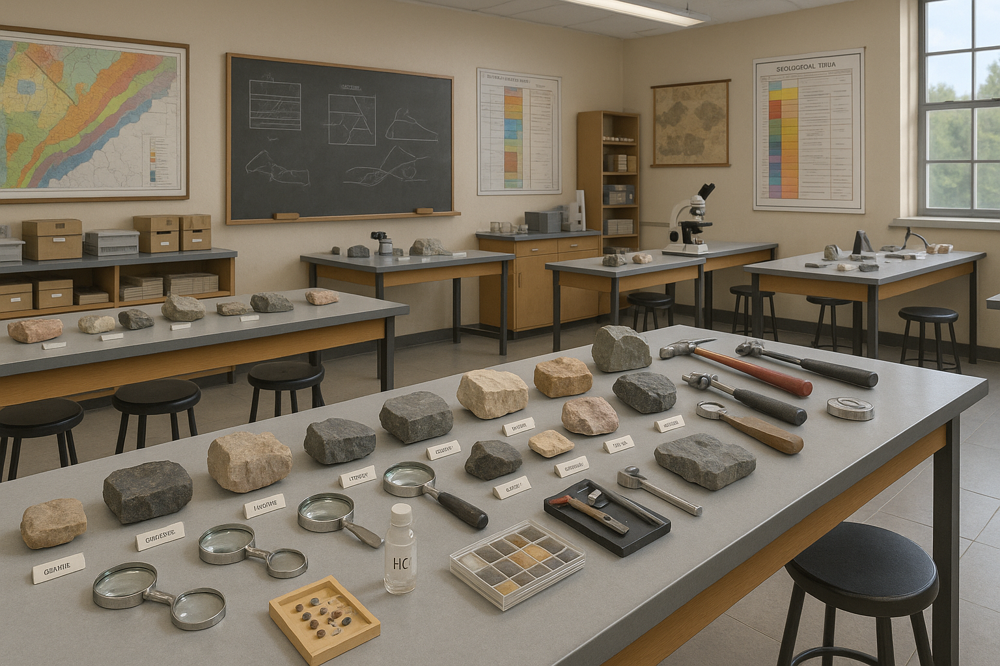

# **Bienvenidos al Laboratorio de Geología Física**

**Universidad Nacional de Colombia – Sede Medellín**  
**Facultad de Minas**  
**Profesor:** Oscar Sánchez  
**Correo:** oisanchezp@unal.edu.co

{width=40%}

**Este espacio es un libro guía para llevar acabo las prácticas del Laboratorio de Geología Física.**
**Aquí encontrarás el contenido del curso, los objetivos, las metodologías de evaluación y cada unos de los temas que se trataran durante el semestre.**
